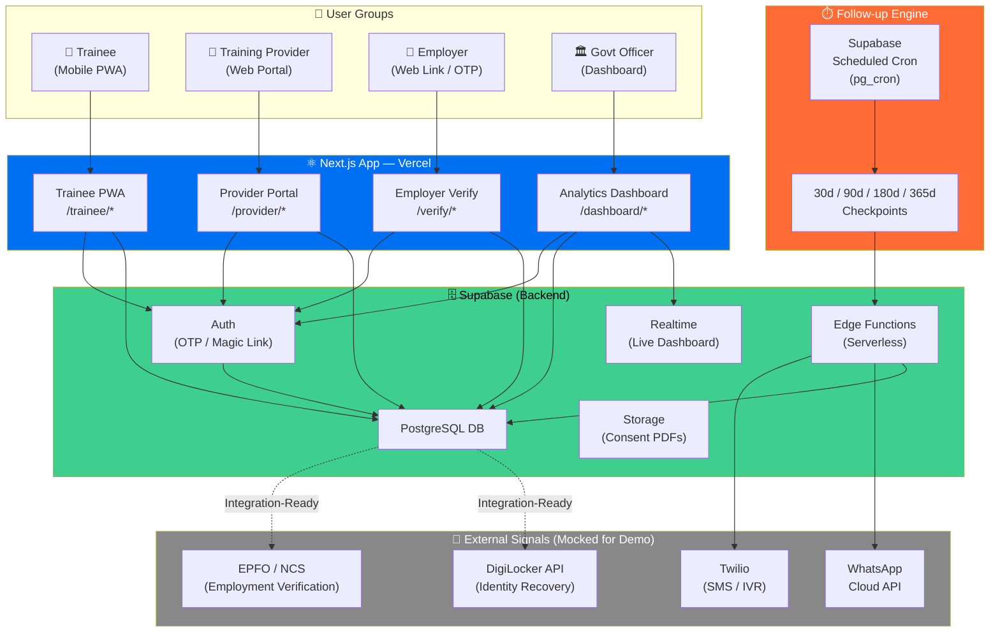
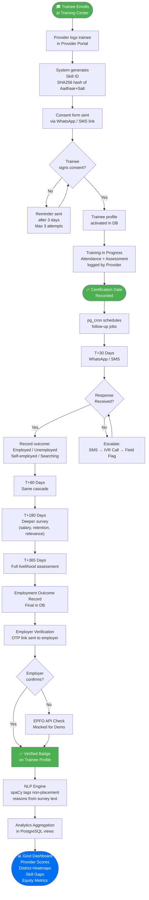
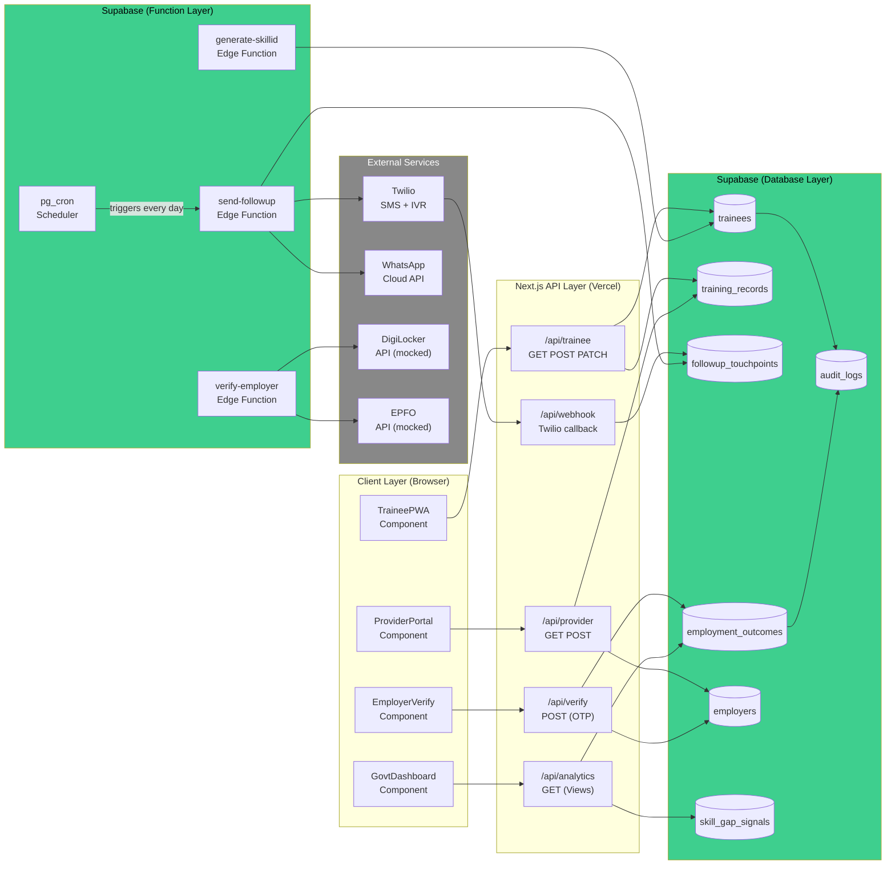
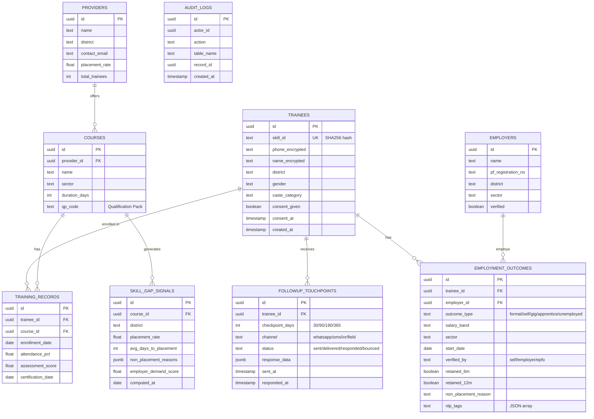

# SkillTrace — Full Architecture & Pipeline

---

## Tech Stack (Final, Simple)

| Layer | Tool | Why Simple |
|---|---|---|
| **Frontend** | Next.js 14 (App Router) | One framework for all 3 portals |
| **Styling** | Tailwind CSS + shadcn/ui | Copy-paste components, looks professional |
| **Database** | Supabase (PostgreSQL) | No setup. Auth + DB + API in 5 min |
| **Follow-up Messaging** | Supabase Edge Functions + Twilio | Cron triggers → SMS, free tier |
| **NLP (Gap Analysis)** | Python script (spaCy) → Supabase | Run once, write results to DB |
| **Charts** | Recharts | Works directly in React, free |
| **Maps** | Leaflet.js + react-leaflet | District heatmap, free |
| **Hosting** | Vercel (Frontend) + Supabase (Backend) | Both free tier, deploy in minutes |

**No Docker. No Celery. No separate backend server. Everything is Supabase + Next.js.**

---

## System Architecture Diagram



---

## Data Flow Pipeline (End-to-End)



---

## UML Component Diagram



---

## Database Schema (Supabase PostgreSQL)



---

## The 4 Portals — What Each Screen Does

### Portal 1: Trainee PWA (`/trainee`)
```
/trainee/onboard        → Consent form + Skill ID generation
/trainee/profile        → Profile page with training history, badges
/trainee/checkin/[id]   → Follow-up survey (link from WhatsApp/SMS)
/trainee/certificate    → Downloadable digital certificate
```

### Portal 2: Provider Portal (`/provider`)
```
/provider/dashboard     → My courses, placement stats, accountability score
/provider/trainees      → List of enrolled trainees + status
/provider/enroll        → Add new trainee (generates Skill ID)
/provider/upload        → Bulk CSV upload
```

### Portal 3: Employer Verify (`/verify`)
```
/verify/[token]         → OTP verification page (no login needed)
                          "Did Rahul Kumar join on 15 Aug? Yes / No"
```

### Portal 4: Govt Dashboard (`/dashboard`)
```
/dashboard              → Overview: state-wide KPIs
/dashboard/providers    → Provider scorecard + ranking
/dashboard/districts    → District heatmap (Leaflet + OpenStreetMap)
/dashboard/cohorts      → Cohort tracker: follow a batch over time
/dashboard/gaps         → Skill gap analysis + NLP tags
/dashboard/equity       → Gender / caste / district equity metrics
/dashboard/reports      → Export PDF reports
```

---

## Follow-up Engine Logic (Supabase pg_cron)

```
Every day at 9:00 AM IST:
  
  1. Query DB: SELECT all training_records 
     WHERE certification_date = TODAY - 30 days   → send 30d touchpoint
     WHERE certification_date = TODAY - 90 days   → send 90d touchpoint
     WHERE certification_date = TODAY - 180 days  → send 180d touchpoint
     WHERE certification_date = TODAY - 365 days  → send 365d touchpoint

  2. For each due trainee:
     a. Check if touchpoint already sent for this checkpoint → skip if yes
     b. Send WhatsApp (attempt 1) → log as 'sent'
     c. If no response in 3 days → send SMS (attempt 2)
     d. If no response in 7 days → trigger IVR call (attempt 3)
     e. If no response in 14 days → flag for field agent

  3. Each unique survey link = /trainee/checkin/[uuid]
     → One-time use, expires in 30 days
     → Pre-fills known info (name, course)
     → 3 questions max per checkpoint
```

---

## Role-Based Access Control (RBAC)

| Role | What They Can See |
|---|---|
| `trainee` | Own profile only |
| `provider_admin` | Their trainees + their courses |
| `employer` | Only verify a specific trainee (via token link) |
| `district_officer` | Analytics for their district only |
| `state_admin` | Full dashboard, all districts, all providers |
| `system_admin` | Full access + audit logs + user management |

Implemented via **Supabase Row Level Security (RLS)** — no extra code needed.

---

## What's Real vs. Mocked for Demo

| Feature | Demo Status | Production Path |
|---|---|---|
| Trainee registration + Skill ID | ✅ Real | Same |
| Consent form saving to DB | ✅ Real | Same |
| Provider trainee enrollment | ✅ Real | Same |
| Follow-up survey form | ✅ Real | Same |
| Employment outcome recording | ✅ Real | Same |
| Analytics dashboard charts | ✅ Real (seeded data) | Live data |
| District heatmap | ✅ Real (seeded data) | Live data |
| SMS via Twilio | ✅ Real (free trial) | Paid Twilio |
| Employer OTP verification | ✅ Real | Same |
| WhatsApp Cloud API | 🟡 Mocked (video demo) | Meta Business approval |
| EPFO employment verification | 🔴 Mocked (spinner + checkmark) | Govt MOU required |
| DigiLocker identity recovery | 🔴 Mocked (button UI only) | NIC API access required |
| IVR phone call (Marathi) | 🔴 Mocked | Twilio Voice + gTTS |
| pg_cron follow-up scheduler | ✅ Real (Supabase built-in) | Same |
